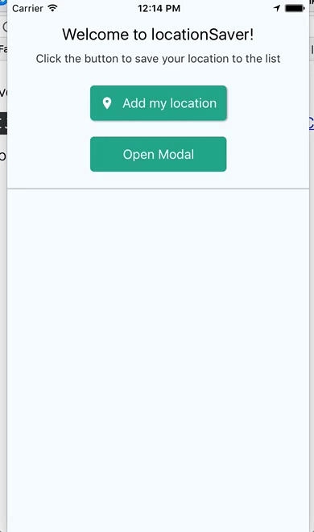
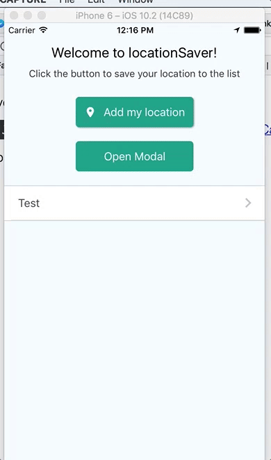

# Location Saver
An app that helps you save your location, in React Native

https://play.google.com/store/apps/details?id=com.locationsaver

If you want to see what I'm doing:
- Clone this repo 
- Checkout to `clone-ready` branch
- Install React Native CLI `npm install -g react-native-cli`
- Run `npm install` 
- Then run `react-native run-android` or `react-native run-ios`.
- :star:

### You can add your own location to the list ###
(_Also rename and delete it_)

### You can then navigate to this location by clicking on a list item ###
_If you have gmaps or citymapper installed you will be asked with which one you want to open the directions_

### You can also add your location to the list with the help of a map and a marker ###

